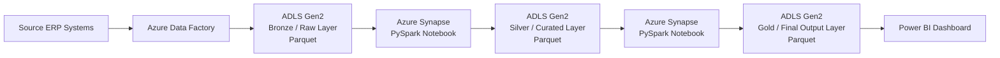
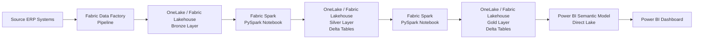
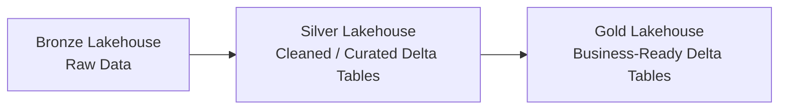
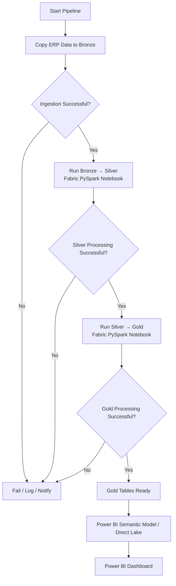

# Azure Synapse to Microsoft Fabric — Architecture Migration

## 1. Purpose

This document captures:

1. The **current Azure-based architecture**.
2. The **target Microsoft Fabric architecture**.
3. A component-by-component migration mapping.
4. Special focus on the migration of **Azure Synapse PySpark notebooks**, which contain the primary business and analytics transformation logic.

---

# 2. Current Architecture — Azure

## 2.1 High-Level Flow



## 2.2 Detailed Current Architecture

```text
┌─────────────────────────────┐
│      Source ERP Systems     │
│                             │
│ SAP / Oracle / Salesforce   │
│ and other source systems    │
└──────────────┬──────────────┘
               │
               ▼
┌─────────────────────────────┐
│     Azure Data Factory      │
│                             │
│ Data ingestion              │
│ Pipeline orchestration      │
└──────────────┬──────────────┘
               │
               ▼
┌─────────────────────────────┐
│          ADLS Gen2          │
│                             │
│      BRONZE / RAW LAYER     │
│        Parquet Files        │
└──────────────┬──────────────┘
               │
               ▼
┌─────────────────────────────┐
│       Azure Synapse         │
│                             │
│      PySpark Notebook       │
│                             │
│ Cleaning                    │
│ Standardization             │
│ Data-quality logic          │
│ Deduplication               │
│ Transformation             │
└──────────────┬──────────────┘
               │
               ▼
┌─────────────────────────────┐
│          ADLS Gen2          │
│                             │
│    SILVER / CURATED LAYER   │
│        Parquet Files        │
└──────────────┬──────────────┘
               │
               ▼
┌─────────────────────────────┐
│       Azure Synapse         │
│                             │
│      PySpark Notebook       │
│                             │
│ Business rules              │
│ Joins                       │
│ Window functions            │
│ Aggregations                │
│ Risk / fraud / audit logic  │
│ Exception identification    │
└──────────────┬──────────────┘
               │
               ▼
┌─────────────────────────────┐
│          ADLS Gen2          │
│                             │
│      GOLD / FINAL LAYER     │
│        Parquet Files        │
└──────────────┬──────────────┘
               │
               ▼
┌─────────────────────────────┐
│          Power BI           │
│                             │
│ Dashboards / Reporting      │
└─────────────────────────────┘
```

---

# 3. Target Architecture — Microsoft Fabric

## 3.1 Recommended High-Level Flow



## 3.2 Detailed Target Architecture

```text
┌─────────────────────────────┐
│      Source ERP Systems     │
│                             │
│ SAP / Oracle / Salesforce   │
│ and other source systems    │
└──────────────┬──────────────┘
               │
               ▼
┌─────────────────────────────┐
│ Microsoft Fabric            │
│ Data Factory                │
│                             │
│ Fabric Pipeline             │
│ Copy / ingestion activities │
│ Pipeline orchestration      │
└──────────────┬──────────────┘
               │
               ▼
┌─────────────────────────────┐
│          OneLake            │
│      Fabric Lakehouse       │
│                             │
│      BRONZE / RAW LAYER     │
│                             │
│ Raw files / Parquet / Delta │
└──────────────┬──────────────┘
               │
               ▼
┌─────────────────────────────┐
│       Fabric Spark          │
│                             │
│      Fabric Notebook        │
│          PySpark            │
│                             │
│ Cleaning                    │
│ Standardization             │
│ Data-quality logic          │
│ Deduplication               │
│ Transformation              │
└──────────────┬──────────────┘
               │
               ▼
┌─────────────────────────────┐
│          OneLake            │
│      Fabric Lakehouse       │
│                             │
│    SILVER / CURATED LAYER   │
│                             │
│       Delta Tables          │
└──────────────┬──────────────┘
               │
               ▼
┌─────────────────────────────┐
│       Fabric Spark          │
│                             │
│      Fabric Notebook        │
│          PySpark            │
│                             │
│ Business rules              │
│ Joins                       │
│ Window functions            │
│ Aggregations                │
│ Risk / fraud / audit logic  │
│ Exception identification    │
└──────────────┬──────────────┘
               │
               ▼
┌─────────────────────────────┐
│          OneLake            │
│      Fabric Lakehouse       │
│                             │
│      GOLD / FINAL LAYER     │
│                             │
│       Delta Tables          │
└──────────────┬──────────────┘
               │
               ▼
┌─────────────────────────────┐
│    Power BI Semantic Model  │
│                             │
│        Direct Lake          │
└──────────────┬──────────────┘
               │
               ▼
┌─────────────────────────────┐
│          Power BI           │
│                             │
│ Dashboards / Reporting      │
└─────────────────────────────┘
```

---

# 4. Current → Fabric Component Mapping

| Current Component | Current Responsibility | Microsoft Fabric Equivalent | Migration Impact |
|---|---|---|---|
| Source ERP systems | Source transactional/business data | Same source ERP systems | Low |
| Azure Data Factory | Ingestion and orchestration | Fabric Data Factory / Data Pipelines | Medium |
| ADLS Gen2 | Physical data-lake storage | OneLake | Medium |
| Bronze Parquet layer | Raw ingested data | Bronze Lakehouse / Files / Delta | Medium |
| Azure Synapse Spark Pool | Spark compute | Fabric Spark compute / Spark pool | Medium |
| Synapse Notebook | PySpark transformations | Fabric Notebook | Medium |
| PySpark code | Core analytics/business logic | PySpark | **Low for core logic; Medium for platform-specific code** |
| Silver Parquet layer | Cleaned and curated data | Silver Lakehouse, preferably Delta tables | Medium |
| Gold Parquet layer | Final analytics/output data | Gold Lakehouse, preferably Delta tables | Medium |
| Power BI | Reporting/dashboarding | Power BI inside Fabric | Low–Medium |
| Traditional dataset refresh | BI data loading | Semantic Model + potentially Direct Lake | Medium |

---

# 5. Most Important Migration: Synapse PySpark → Fabric PySpark

The PySpark notebooks are the **main processing brain of the architecture**.

The migration should therefore be treated as two separate concerns:

```text
Synapse Notebook
│
├── Business / transformation logic
│      ↓
│   Mostly portable
│
└── Azure/Synapse-specific infrastructure logic
       ↓
    Requires review/refactoring
```

## 5.1 Code Expected to Remain Largely the Same

Typical PySpark transformations remain conceptually unchanged:

```python
df.filter(...)
df.select(...)
df.join(...)
df.groupBy(...)
df.agg(...)
df.withColumn(...)
df.dropDuplicates(...)
```

Window-based logic also remains PySpark:

```python
from pyspark.sql.window import Window

Window.partitionBy(...).orderBy(...)
```

Core business logic such as:

- Data cleaning
- Deduplication
- Type casting
- Standardization
- Joining ERP datasets
- Aggregations
- Window functions
- Exception logic
- Fraud/risk rules
- Audit analytics
- MIS calculations

should generally remain written in PySpark.

---

# 6. PySpark Code Areas That Require Migration Review

## 6.1 Storage Paths

### Current

```python
bronze_path = (
    "abfss://bronze@storageaccount.dfs.core.windows.net/"
    "procurement/invoices/"
)

df = spark.read.parquet(bronze_path)
```

### Fabric Direction

Data can instead be accessed through the Fabric Lakehouse / OneLake architecture.

For Lakehouse tables, code may become table-oriented:

```python
df = spark.table("bronze_invoices")
```

or Delta-oriented:

```python
df = spark.read.format("delta").load("Tables/bronze_invoices")
```

---

## 6.2 Output Format

### Current

```python
df.write \
    .mode("overwrite") \
    .parquet(silver_path)
```

### Fabric Direction

Silver and Gold datasets should strongly consider Delta tables:

```python
df.write \
    .format("delta") \
    .mode("overwrite") \
    .saveAsTable("silver_invoices")
```

---

## 6.3 Synapse Utilities

Code using Synapse-specific utilities needs review.

Example:

```python
mssparkutils
```

Fabric equivalents use Fabric notebook utilities such as:

```python
notebookutils
```

The exact replacement should be validated function-by-function during migration.

---

## 6.4 Linked Services and Authentication

Current Synapse notebooks may depend on:

- Synapse Linked Services
- ADLS credentials
- Managed identities
- Storage-account configurations
- Secrets
- External JDBC connections

These integrations must be mapped to Fabric-native:

- Connections
- Credentials
- Workspace configuration
- Lakehouse access
- External-system connections

---

## 6.5 Spark Runtime and Libraries

The following must be validated:

```text
Synapse Spark runtime
        ↓
Fabric Spark runtime

Synapse Spark pool
        ↓
Fabric Spark compute / pool

Synapse-installed libraries
        ↓
Fabric Environment / dependencies
```

Custom packages, Python libraries, `.whl` files, configuration values and Spark properties must be inventoried and recreated where necessary.

---

# 7. Recommended Fabric Medallion Design

A clean Fabric implementation could use three logical Lakehouse layers:



## Bronze

Purpose:

- Preserve source data
- Minimal transformations
- Maintain traceability to ERP
- Support reprocessing

Possible storage:

```text
Lakehouse
└── Files
    └── Bronze
```

or a dedicated Bronze Lakehouse.

---

## Silver

Purpose:

- Cleansing
- Standardization
- Deduplication
- Data-quality checks
- Schema normalization
- ERP harmonization
- Reusable curated datasets

Preferred representation:

```text
Delta Tables
```

---

## Gold

Purpose:

- Business logic
- Audit analytics
- Risk/fraud detection
- KPI calculations
- Exception datasets
- Dashboard-ready datasets
- Aggregations

Preferred representation:

```text
Delta Tables
```

The Gold layer should be designed around downstream analytics and Power BI consumption.

---

# 8. End-to-End Fabric Pipeline

A Fabric Data Factory pipeline could orchestrate the complete process.



---

# 9. Before vs After — Simplified Comparison

## Current

```text
ERP
 │
 ▼
Azure Data Factory
 │
 ▼
ADLS Gen2 — Bronze — Parquet
 │
 ▼
Azure Synapse Spark
 │
 ▼
Synapse PySpark Notebook
 │
 ▼
ADLS Gen2 — Silver — Parquet
 │
 ▼
Azure Synapse Spark
 │
 ▼
Synapse PySpark Notebook
 │
 ▼
ADLS Gen2 — Gold — Parquet
 │
 ▼
Power BI
```

## Fabric

```text
ERP
 │
 ▼
Fabric Data Factory
 │
 ▼
OneLake / Lakehouse — Bronze
 │
 ▼
Fabric Spark
 │
 ▼
Fabric PySpark Notebook
 │
 ▼
OneLake / Lakehouse — Silver — Delta
 │
 ▼
Fabric Spark
 │
 ▼
Fabric PySpark Notebook
 │
 ▼
OneLake / Lakehouse — Gold — Delta
 │
 ▼
Power BI Semantic Model / Direct Lake
 │
 ▼
Power BI
```

---

# 10. Key Architectural Translation

```text
Azure Data Factory
        ↓
Fabric Data Factory


ADLS Gen2
        ↓
OneLake


ADLS Containers / Paths
        ↓
Fabric Lakehouse Files / Tables


Parquet-only architecture
        ↓
Delta-oriented Lakehouse architecture


Synapse Spark Pool
        ↓
Fabric Spark Compute


Synapse Notebook
        ↓
Fabric Notebook


PySpark
        ↓
PySpark


Synapse-specific utilities
        ↓
Fabric Notebook utilities


Synapse Linked Services
        ↓
Fabric Connections / Credentials


Power BI external to processing stack
        ↓
Power BI integrated into Fabric


Traditional BI refresh architecture
        ↓
Semantic Model + potential Direct Lake
```

---

# 11. Migration Validation Strategy

The migration should not be considered successful merely because a Fabric notebook executes without errors.

For every Bronze → Silver and Silver → Gold transformation, compare old and new outputs.

## Recommended checks

```text
Row counts
Primary-key counts
Distinct-value counts
Null counts
Duplicate counts
Data types
Schema
Aggregated monetary values
Date ranges
Exception populations
Risk/fraud-rule outputs
Business KPI values
```

Example:

```text
Synapse Gold Exception Count
             =
Fabric Gold Exception Count
```

and:

```text
SUM(Synapse invoice_amount)
             =
SUM(Fabric invoice_amount)
```

Any unexplained difference should be treated as a migration defect.

---

# 12. Recommended Migration Workstreams

## Workstream 1 — Inventory

Catalogue:

- ADF pipelines
- Source connections
- ADLS containers and paths
- Synapse notebooks
- Spark pools
- Custom libraries
- Linked services
- Power BI dependencies

---

## Workstream 2 — Storage Migration

Map:

```text
ADLS Bronze → Fabric Bronze
ADLS Silver → Fabric Silver
ADLS Gold   → Fabric Gold
```

Decide where Parquet should remain and where Delta tables should be introduced.

---

## Workstream 3 — PySpark Migration

For every notebook:

1. Identify pure PySpark transformation logic.
2. Identify Synapse-specific code.
3. Identify ADLS paths.
4. Identify `mssparkutils` usage.
5. Identify Linked Service dependencies.
6. Identify libraries/packages.
7. Move the notebook to Fabric.
8. Refactor infrastructure-specific code.
9. Execute.
10. Validate output against Synapse.

---

## Workstream 4 — Pipeline Migration

Recreate orchestration in Fabric Data Factory:

```text
ERP ingestion
    ↓
Bronze
    ↓
Bronze → Silver Notebook
    ↓
Silver → Gold Notebook
    ↓
BI consumption
```

---

## Workstream 5 — Power BI Integration

Evaluate:

```text
Gold Delta Tables
        ↓
Semantic Model
        ↓
Direct Lake
        ↓
Power BI
```

rather than automatically reproducing the existing refresh mechanism.

---

# 13. Main Architectural Principle

The migration should **not** be treated as:

> "Move the same Azure components into another Microsoft UI."

The stronger design is:

> **Use Microsoft Fabric as a unified data platform while preserving the proven PySpark business logic and modernizing the surrounding storage, compute, orchestration and BI integration.**

The most valuable reusable asset in the current project is therefore the **business transformation and analytics logic inside the PySpark notebooks**.

That logic should be preserved wherever possible, while the infrastructure-specific parts are systematically migrated to Fabric-native patterns.
